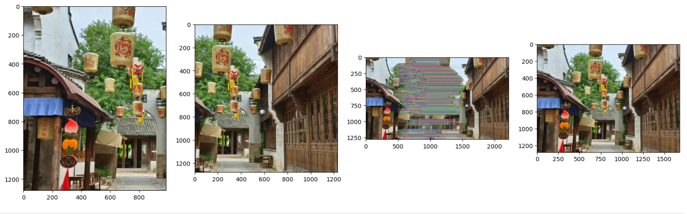

# Experiment3-image_fusion(实验三-图像融合)
##### This experiment achieves image stitching based on SIFT feature matching and perspective transformation
###### 实验基于 SIFT 特征匹配与透视变换，完成图像拼接

## 1.Experimental Purpose
##### To stitch two images with overlapping regions into a complete image by using SIFT feature matching and perspective transformation techniques, and verify the effectiveness of the image stitching process.

###### 利用SIFT特征匹配和透视变换技术，将具有重叠区域的两幅图像拼接成一幅完整图像，并验证图像拼接过程的有效性。

##


## 2.Experimental Content

#### 2.1 Image Reading and Preprocessing

##### Read the two images to be stitched and convert them into grayscale images to prepare for subsequent feature extraction
##
###### 2.1.1读取待拼接的两张图像，并将其转为灰度图，为后续特征提取做准备

```
import cv2
import numpy as np
import matplotlib.pyplot as plt
```
```
img_a = cv2.imread(r"C:\Users\Wxy\Desktop\computer-vision\3-1.jpg")
img_b = cv2.imread(r"C:\Users\Wxy\Desktop\computer-vision\3-2.jpg")
```
###### 图像a转灰度：cv2.COLOR_BGR2GRAY将BGR格式转为灰度格式
```
gray_a = cv2.cvtColor(img_a,cv2.COLOR_BGR2GRAY)
gray_b = cv2.cvtColor(img_b,cv2.COLOR_BGR2GRAY)
```
##
#### 2.2 SIFT Feature Extraction and Matching


##### Initialize the SIFT detector to extract feature points and descriptors from the two grayscale images.Use the FLANN matcher to match the features,and then filter out high-quality matching points through Lowe's ratio test.

###### 初始化 SIFT 检测器，提取两张灰度图的特征点与描述符，用 FLANN 匹配器匹配特征，再通过 Lowe's 比率测试筛选优质匹配点

##
###### 2.2.1初始化SIFT检测器并提取特征
```
sift = cv2.SIFT_create() #提取图像a的特征：detectAndCompute()返回关键点（kp_a）和描述符（des_a），None表示不使用掩码
kp_a,des_a = sift.detectAndCompute(gray_a,None)   # 图像a的关键点（位置、尺度等）和描述符（128维向量）
kp_b,des_b = sift.detectAndCompute(gray_b,None)   #图像b的关键点和描述符
```
##
###### 2.2.2使用FLANN匹配器进行特征匹配
######      使用FLANN匹配器进行特征匹配：FLANN（快速最近邻搜索库）比暴力匹配更快，适合大量特征点匹配
######      定义FLANN匹配器的算法类型：K-D树算法（适合高维数据匹配）
```
FLANN_INDEX_KDTREE = 1

#配置FLANN的索引参数：algorithm指定算法类型，trees=5表示构建5棵K-D树（平衡速度与精度）
index_params = dict(algorithm=FLANN_INDEX_KDTREE,trees=5)

#配置FLANN的搜索参数：checks=50表示每个特征点最多检查50个邻居，次数越多匹配越准但速度越慢
search_params = dict(checks=50)  #检查次数越多匹配越准确但速度更慢

#创建FLANN匹配器实例：传入索引参数和搜索参数
flann = cv2.FlannBasedMatcher(index_params,search_params)
matches = flann.knnMatch(des_a,des_b,k=2)  #k=2表示每个特征点返回2个最佳匹配
```
##
###### 2.2.3应用Low's比率测试筛选优劣匹配点
```
good_matches = []
for m,n in matches:
        if m.distance <0.6 * n.distance:
             good_matches.append(m)
#Lowe's比率测试：若第一匹配距离 < 0.7*第二匹配距离，判定为优质匹配（0.7是经验阈值，可在0.7-0.8调整） 
```
##
###### 2.2.4绘制匹配的SIFT关键点：drawMatches()将两张图像的关键点与匹配线绘制在同一张图中
```
matched_keypoints_img = cv2.drawMatches(
                        img_a,kp_a,img_b,kp_b,good_matches,    
                        None,flags=cv2.DrawMatchesFlags_NOT_DRAW_SINGLE_POINTS  )
```
##
###### 2.2.5提取匹配点的坐标
```
#提取图像b的匹配点坐标：m.trainIdx是b中与a匹配的特征点索引，pt是关键点的(x,y)坐标；
#转换为float32类型并reshape为(-1,1,2)（OpenCV透视变换要求的输入格式：N个点，每个点为1×2向量）
src_pts = np.float32([kp_b[m.trainIdx].pt for m in good_matches]).reshape(-1,1,2)#图像b的关键点
dst_pts = np.float32([kp_a[m.queryIdx].pt for m in good_matches]).reshape(-1,1,2)#图像a的关键点
```
##
#### 2.3 Perspective Transformation and Image Fusion


##### Calculate the homography matrix using the RANSAC algorithm based on the high-quality matching points,determine the size of stitched image,perform perspective transformation on one of the images,and then copy the other image to the corresponding position in the fused image

###### 基于优质匹配点，用RANSAC算法计算单应矩阵，确定,拼接后的图像大小，将其中一张图片透射变换，把另一张图片复制到对应的位置
##
###### 2.3.1使用RANSAC算法估计单应矩阵（透视变换矩阵）

######      计算单应矩阵：cv2.findHomography()输入源点、目标点，用RANSAC鲁棒算法，重投影误差阈值5.0；
```
H,_ = cv2.findHomography(src_pts,dst_pts,cv2.RANSAC,3.0)
#返回H（3×3单应矩阵）和mask（匹配点是否为inlier的掩码）
```
##
###### 2.3.2获取输入图像的尺寸：img_a.shape[:2]返回(高度, 宽度)，因为OpenCV中图像格式为(H,W,C)
```
h_a, w_a = img_a.shape[:2]
h_b, w_b = img_b.shape[:2]
```
##
###### 2.3.3计算图像b变换后的四个角坐标
```
#定义图像b的四个原始角点：按“左上(0,0)、左下(0,h_b)、右下(w_b,h_b)、右上(w_b,0)”顺序
pts = np.float32([[0,0],[0,h_b],[w_b,h_b],[w_b,0]]).reshape(-1,1,2)

#计算变换后的角点：cv2.perspectiveTransform()用单应矩阵H变换图像b的角点，得到在图像a坐标系中的位置
dst_corners = cv2.perspectiveTransform(pts,H)
```
##
###### 2.3.4确定拼接后图像的最终尺寸（包含所有图像）
```
#合并所有角点：将图像b变换后的角点（dst_corners）与图像a的原始角点（[0,0],[w_a,0],[w_a,h_a],[0,h_a]）合并；
all_corners = np.concatenate([dst_corners,np.float32([[0,0],[w_a,0],[w_a,h_a],[0,h_a]]).reshape(-1,1,2)],axis=0)

#计算拼接图像的最小/最大坐标：all_corners.min/max(axis=0)获取所有角点的x/y最小/最大值；
[x_min,y_min] = np.int32(all_corners.min(axis=0).ravel() - 0.5)
[x_max,y_max] = np.int32(all_corners.max(axis=0).ravel() + 0.5)
#ravel()将二维数组展平，减0.5/加0.5是为了避免整数截断误差，最后转为int32类型（坐标需为整数）
```
##
###### 2.3.5创建平移矩阵确保所有像素都在可见区域内
```
#构造3×3平移矩阵：透视变换需3×3矩阵，[1,0,-x_min]表示x轴平移-x_min（抵消负坐标），[0,1,-y_min]表示y轴平移-y_min；
translation_matrix = np.array([[1,0,-x_min],[0,1,-y_min],[0,0,1]],dtype=np.float32)
```
##
###### 2.3.6对图像b进行透视变换和平移
```
#执行透视变换：cv2.warpPerspective()根据组合矩阵变换图像b，输出尺寸为(x_max-x_min, y_max-y_min)（覆盖所有像素）
fus_img = cv2.warpPerspective(img_b,
                              translation_matrix @ H,       #组合平移矩阵和单应矩阵    
                              (x_max - x_min,y_max - y_min) #输出图像尺寸 )
```
##
###### 2.3.7将图像a复制到拼接结果的对应位置
```
fus_img[-y_min:h_a - y_min,-x_min:w_a - x_min] = img_a
```
##
#### 2.4 Result Visualization


##### Use matplotlib plot the orginal images,the feature matching results,and the final stitched images,so as to display the experimental effect.

###### 用matplotlib画出原始图像，特征匹配结果，最后拼接的图像作为实验效果

```
#显示匹配关键点和拼接结果
plt.figure(figsize=(20,20))
plt.subplot(1,4,1)
plt.imshow(cv2.cvtColor(img_a,cv2.COLOR_BGR2RGB))
plt.subplot(1,4,2)
plt.imshow(cv2.cvtColor(img_b,cv2.COLOR_BGR2RGB))
plt.subplot(1,4,3)
plt.imshow(cv2.cvtColor(matched_keypoints_img,cv2.COLOR_BGR2RGB))
plt.subplot(1,4,4)
plt.imshow(cv2.cvtColor(fus_img,cv2.COLOR_BGR2RGB))
```

## 3.Experimental Results and Analysis
##### Three sets of images were tested in this experiment.

###### 本实验测试了三组图像

##### From  left to right are the original images A and B,followed by the generated results images(including original image A,original image B,the image with connected high-quality matching points,and the stitched result image)

###### 从左到右依次为原始图像A和B，以及生成的结果图像（包括原始图像A、原始图像B、含有连接的高质量匹配点的图像，以及拼接后的结果图像）

###### Picture-1
<table>
 <tr>
 <td></td>
 <td></td>
 <td></td> 
 </tr>
</table>

###### Picture-2
<table> 
<tr> 
<td></td> 
<td></td> 
<td></td>  
</tr>
</table>

###### Picture-3
<table> 
<tr> 
<td></td> 
<td></td> 
<td></td>  
</tr>
</table>


